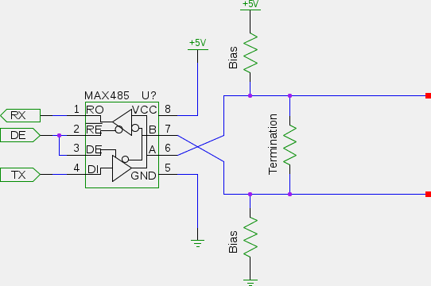

Building an RS-485 Network
==========================

RS-485 (also known as EIA-485) is a serial protocol using differential signalling capable of cable lengths of up to 4km, data rates of up to 10Mbps, and 32 devices (more with modern low-power driver chips) on one bus.

To interface a serial device like an Arduino to an RS-485 bus requires a driver circuit to convert the TTL signal levels to the differential voltages required by RS-485.

RS-485 comes in two flavours; half duplex and full duplex. Half duplex is far simpler to build, and it is this variety we shall be focussing on here.

A basic transceiver circuit based around the popular MAX485 (or MAX3485 for 3.3V operation) chip is as follows:

The "Bias Resistors" should only be provided at one location within the RS-485 bus, and should be in the order of 560Ω. The purpose of these is to hold the signals at a stead idle state when all the units on the bus are in receive mode.

The "Termination Resistor" should be present at both ends of the bus, but not in the middle. This should be as close to the end of the cable as possible and should match the characteristic impedance of the cable as closely as possible. For typical twisted pair cable this would be somewhere around 100Ω-120Ω.

Connecting the nodes together into a bus is done like this:

The cable should be shielded twisted pair, with the shield connected to ground at each node via a resistor Rg (typically 100Ω). Note how the bias resistors Rb are only present at one end, and the middle nodes lack the terminating resistor Rt. The distance between the bus cable and node 2 should be kept as short as possible - ideally the bus cable would enter one side of node 2 and exit the other side to keep the distance to an absolute bare minimum.

